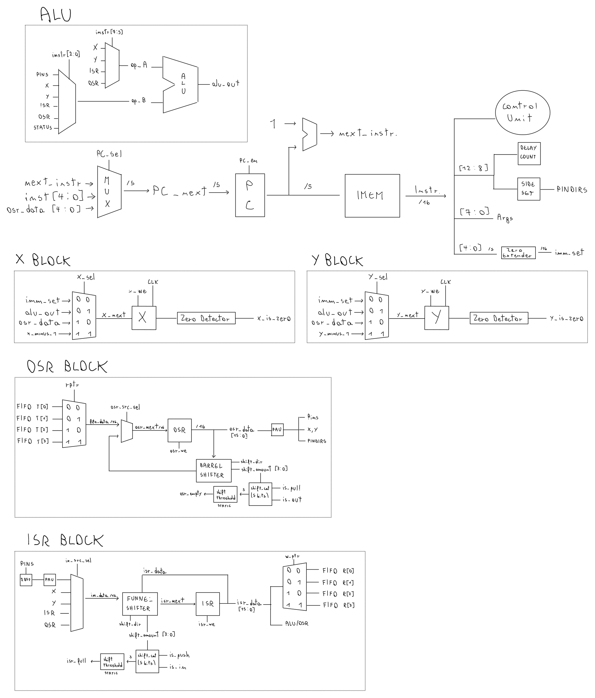
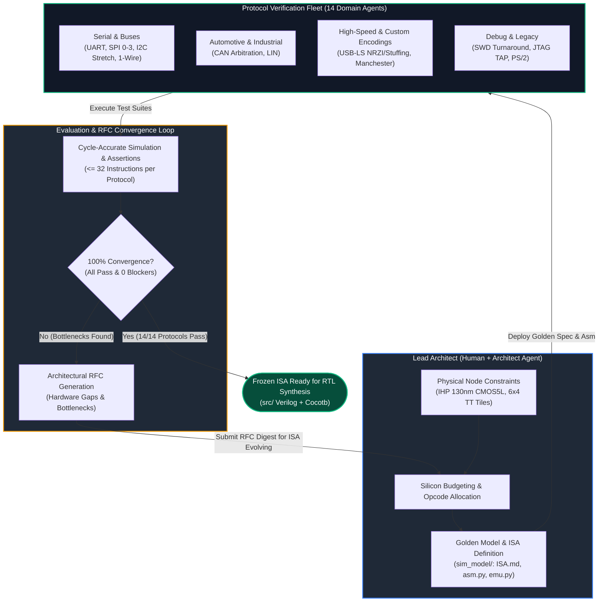

**openPIO** is a lightweight, fully open-source protocol emulator and I/O co-processor targeting the **IHP 130nm CMOS5L** process via Tiny Tapeout.

Imagine you need to talk to a sensor, a display, or a custom device using a serial protocol (like UART, SPI, or I2C). 

Normally, you have two choices:
1. **Use a fixed hardware peripheral**: If your microcontroller has a spare UART or SPI port, great. But if you run out of them, or if you need a non-standard protocol, you are out of luck.
2. **"Bit-bang" it in software**: You manually toggle GPIO pins high and low from your main CPU code using delay loops or timer interrupts.

Option 2 sounds easy, but it quickly falls apart:
* **Your CPU wastes time**: It spends precious clock cycles doing nothing but waiting a few microseconds between pin toggles.
* **Jitter and broken timing**: A single background task or interrupt can delay your code by a couple of microseconds, corrupting the packet and crashing the communication.

What if you had a tiny, separate hardware helper whose only job was to flick pins up and down with cycle-accurate precision, completely independent of your main CPU?

That is what a **PIO (Programmable Input/Output)** does, a concept made famous by the Raspberry Pi RP2040. It is a tiny, stripped-down processor with a custom instruction set designed purely for shifting bits into and out of pins with zero timing jitter.

Standard PIO architectures are great for clean serial streams (like SPI or simple UART), but they hit a wall when protocols get messy:
* **Manchester encoding** (used in 10BASE-T Ethernet) requires flipping the clock on every single bit. Doing that in pure firmware eats up program memory and clock cycles.
* **Bit-stuffing and NRZI** (used in USB) force the software to constantly check for consecutive ones and insert zeros on the fly. In standard PIO assembly, this quickly blows past instruction limits.

**openPIO bridges this gap by introducing the PAU (Protocol Acceleration Unit).**

Instead of forcing you to choose between a rigid hardwired peripheral (inflexible) and a standard PIO core (too slow for complex line encodings), openPIO gives you programmable state machines backed by dedicated, toggleable micro-hardware:

* **Cycle-accurate execution**: Every instruction has deterministic latency with built-in side-set and delays.
* **Hardware protocol assist (PAU)**: In-flight NRZI encoding, automated bit-stuffing for USB, and Manchester TX/RX logic directly in the datapath.
* **Tiny footprint**: Designed to fit comfortably within a 6x4 tile budget on the IHP 130nm CMOS5L node.

In short: **openPIO gives you the freedom of software bit-banging with the rock-solid reliability of dedicated silicon.**

## Microarchitecture & Datapath Evolution

The core microarchitecture was thought and designed by hand.

- **16-bit Deterministic Datapath**: Single-cycle ALU operations (`MOV`, `ADD`, `XOR`, `REV`), shift registers (ISR/OSR), and scratchpad registers (X, Y).
- **Integrated PAU**:
  - Hardware NRZI differential encoding/decoding.
  - Transparent in-flight bit-stuffing counter (stuffed '0' injected after six consecutive '1's without stalling the execution pipeline).
  - Dedicated Manchester transmitter with programmable baud prescaler.
- **True Open-Drain & Bidirectional Support**: Integrated pad control masks line direction (`PINDIRS`) and level (`GPIO_OUT`) simultaneously via 1-cycle side-sets.
- **Hardware Timeout Guards**: Real-time cycle guard counters prevent indefinite hangs during clock-stretching or missing external slave pulses.
- **Strict Silicon Footprint**: Engineered to fit within 24 Tiny Tapeout tiles (~0.7 mm² / ~24k standard cells).

# Co-Design Methodology

To ensure the custom 16-bit PIO instruction set satisfied real-world constraints across diverse hardware protocols within a strict 32-instruction memory ceiling, we developed an autonomous multi-agent hardware-software co-design loop.

Lead Architect (Human + Architect Agent): Defined physical node boundaries (IHP 130nm CMOS5L, 6x4 Tiny Tapeout tiles), established silicon budget constraints, and steered opcode allocation.

Protocol Verification Fleet (Worker & Domain Workers): 14 domain-specialized agents autonomously implemented drivers and unit tests for 14 physical communication protocols (UART, SPI 0-3, I2C with clock stretching, 1-Wire, CAN arbitration, LIN, USB-LS, Manchester/10BASE-T, SWD, JTAG, PS/2).

RFC-Driven ISA Convergence: Limitations discovered by worker agents were formalized as architectural RFCs and iteratively integrated into sim_model/ until 100% test convergence was achieved.
